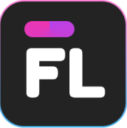

  
  <h3 align="center">Figmaland Responsive Landing Page</h3>

## 📌 Project Overview

As part of the **Frontend Fundamentals** course, I implemented a responsive landing page based on a provided design. This project focuses on practicing semantic markup, styling with CSS, and basic JavaScript functionality.

## 🔗 Project Link

Check out the live version of the project here:
<a href="https://yevhenmartynych.github.io/html-figmaland/" target="_blank"> 🖇️ FigmaLand Website</a>

[Project Demo](https://yevhenmartynych.github.io/html-figmaland/)

## 🛠️ Technologies

The project was built using the following technologies:

  
  
  
  
  

## 👨‍💻 Author

  

Feel free to connect with me!
